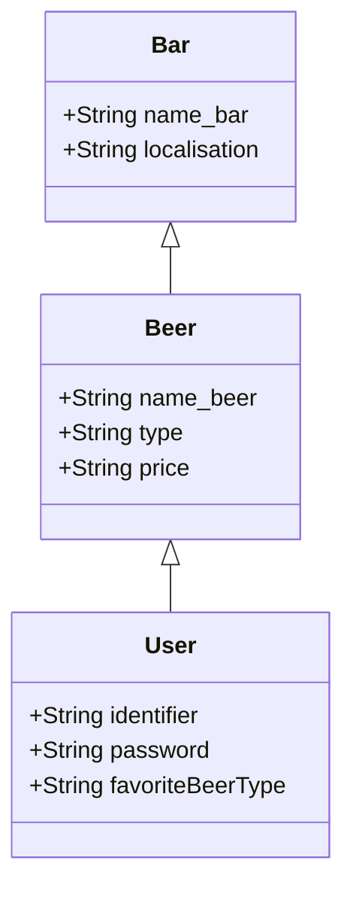

# Projet BIERE

## Qu'est-ce que le projet BIERE ?

Le projet BIERE, pour "Bacchus : Identification Et Récupération des Établissements", vise à donner des adresses de bars à ses utilisateurs, selon leur localisation et leur profil (péférence en matière de type de bière et budget).

## Comment ça marche ?

Le projet BIERE est une application dans laquelle l'utilisateur renseigne le lieu où il se trouve. 
L'application requête ensuite l'API Places de Google Maps afin de trouver les lieux.

## Structure des données

## Auteurs

BERTAIL Aurélien
ÉVAIN Manon
MACAUX Lucas
