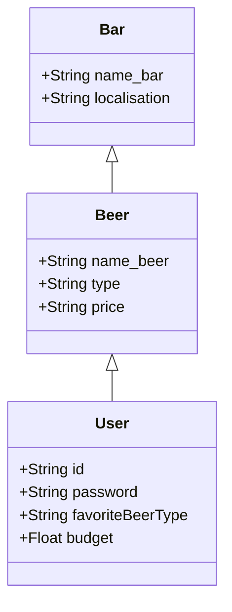

# Project BIERE

## What is the BIERE project ?

The BIERE project (for "Bacchus : Identification Et Récupération des Établissements") is a french application aiming to give pubs' adresses to users, according to their localisation and their profile (the favorite beer flavor and their budget).

## How does it work ?

Le projet BIERE est une application dans laquelle l'utilisateur renseigne le lieu où il se trouve. 
L'application cherche ensuite dans sa base de données des bars situés dans le lieu indiqué par l'utilisateur, et vendant des bières du type de l'utilisateur et dans son budget.
L'application renvoie ensuite le nom des bars correspondanys

## Data structure

## Authors

BERTAIL Aurélien
ÉVAIN Manon
MACAUX Lucas
