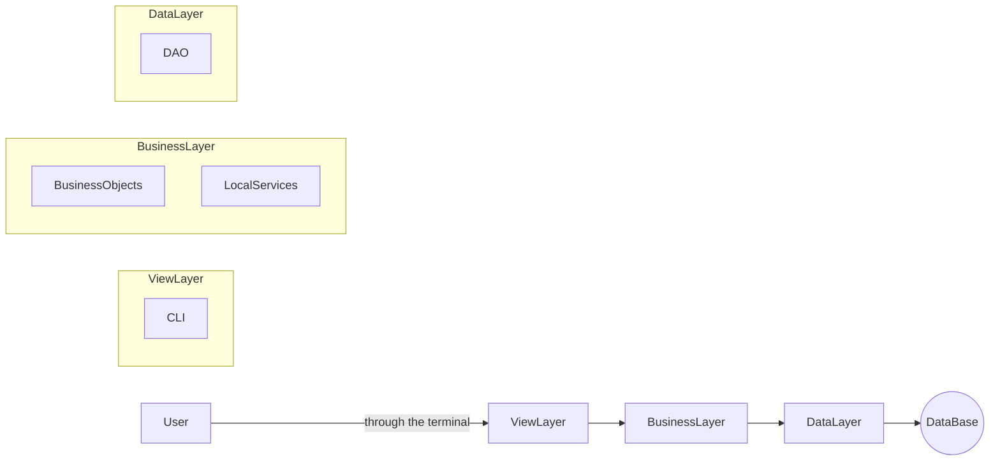
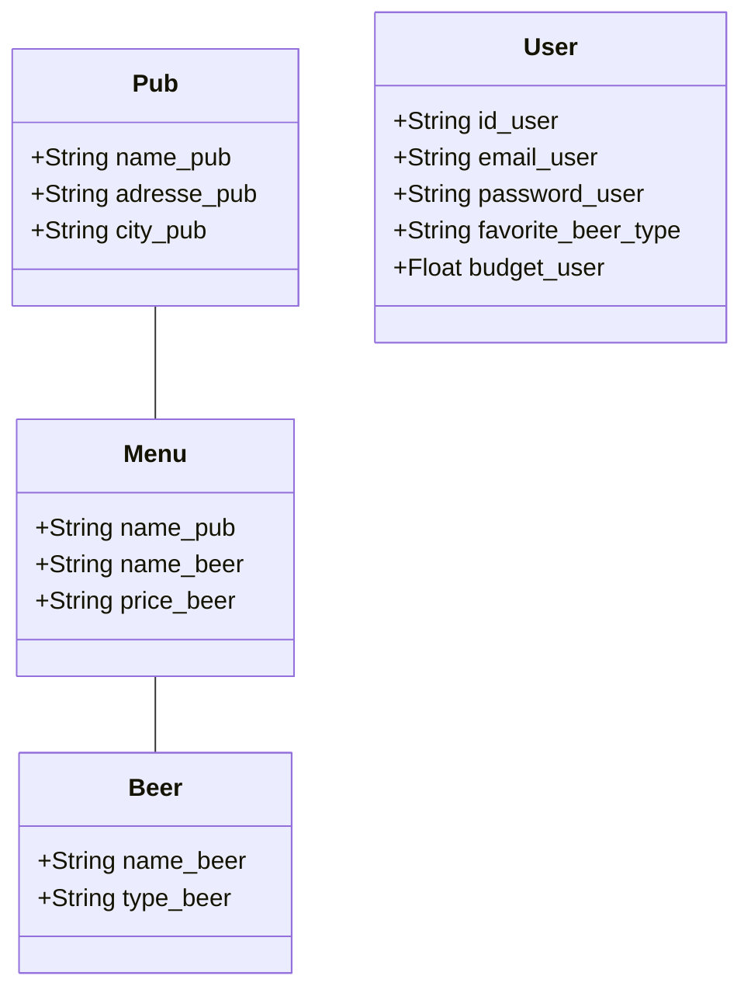

# Project BIERE
## What is the BIERE project ?

The BIERE project (for "Bacchus : Identification Et Récupération des Établissements") is a french application aiming to give pubs' adresses to users, according to their localisation and their profile (the favorite beer flavor and their budget).

## Installation
### Via Docker

1. Make sure you have Docker installed on your system.
2. Clone this repository: `git clone https://github.com/DonMako/beer.git`
3. Navigate to the root directory of the cloned repository: `cd beer`
4. Build the Docker image: `docker build -t mybeerapp .`
5. Run the Docker container: `docker run -it mybeerapp`

### Via the Python interpreter

If you have Python 3.8 and pip installed on your system, you can install and execute the BIERE project from its sources:

```
git clone https://github.com/DonMako/beer.git
cd beer
pip install -r requirements.txt
python main.py
```

## How does it work ?

The user of the BIERE project must connect to his account or create one.
The user can then access all the features allowed by the application:
- change information on his/her account or delete it;
- use the main deature of the application: the localisation of pubs.

### If the user chooses to use the main feature of the application :

The user must indicate his/her localisation. The application searches then in its database the name of pubs that
- are located in the localisation indicated by the user in his/er profile;
- are selling beers from the favorite beer type of the user and in his/her budget.
The application displays finally the name of the corresponding pubs.

## Structure of the project


    
The BIERE project leaves the choice of the database engine to the user.

It is for the moment possible to use PostgreSQL or SQLite. 

### Data structure



## Ideas for the future

Here are some ideas that we want to implement to increase the utility of the project BIERE :
- make phone version of the application (IOS & Android);
- use Google Maps' API Places instead of a fixed database of pubs, so that the data would be up-to-date.

## Authors

MACAUX Lucas, BERTAIL Aurélien & EVAIN Manon